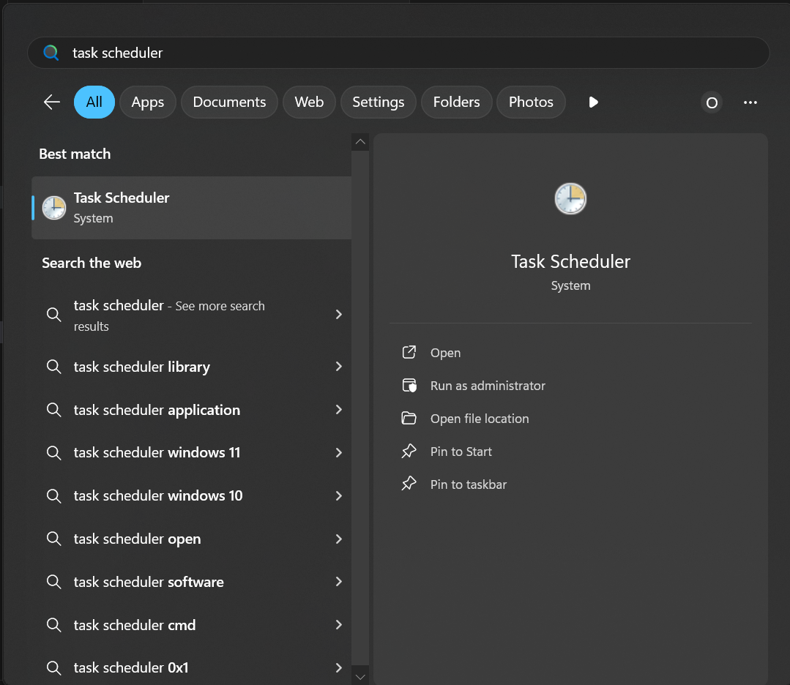

# CSV to SQL Server ETL Tool

This project is a Python-based ETL (Extract, Transform, Load) tool designed to process CSV files and load them into an SQL Server database. The tool reads CSV files from a specified folder, creates corresponding tables in the database, and inserts the data.

---

## Features
- Automatically checks if the database exists and creates it if necessary.
- Processes all `filetype` files in the specified folder. This variable is editable in `csv_processing.py`.
- Dynamically creates SQL Server tables based on CSV headers and data types.
- Logs key operations in a log file for monitoring and debugging.

---

## Prerequisites
### Software Requirements
- Python 3.8+
- SQL Server (with SQL Server Management Studio recommended)

### Python Libraries
Install the required libraries using `pip`:
```bash
pip install -r requirements.txt
```
The main dependencies are:
- `pyodbc`
- `pandas`
- `python-dotenv`

### Configuration
1. Create a `.env` file in the root directory with the following details:
   ```env
   Servername=YOUR_SERVER_NAME
   DatabaseName=YOUR_DATABASE_NAME
   userid=YOUR_SQL_USERNAME
   password=YOUR_SQL_PASSWORD
   ```
2. Place your CSV files in a folder named `csv_files` in the root directory.

---

## How to Run
1. Clone this repository:
   ```bash
   git clone https://github.com/odilbekmarimov-Files-to-Tables-ETL-process.git
   cd odilbekmarimov-Files-to-Tables-ETL-process
   ```

2. Ensure the required Python libraries are installed:
   ```bash
   pip install -r requirements.txt
   ```

3. Ensure the `.env` file is configured and SQL Server is running.

4. Run the main script:
   ```bash
   python main.py
   ```

5. Logs of the process will be saved in `program_log.txt` and displayed in the console.
## Setting up auto runner

1. Press `Win` then search for `Task Scheduler` and open it.


2. Navigate to right tool bar then select `Import Task`
 

3. Navigate to the clone of the repository, then select `scheduler_template.xml` file


4. Choose required configurations. 
   
   Name of the task can be edited to your preferences and for clarity


   In `Triggers` menu time at which script is runned is set. By default script runs once every day at 6 pm. To make several runs, `New Trigger` should be added


6. In `Actions` menu path to the `auto_runner.bat` bat file has to be indicated. By default, it is located in main folder of repository

---

## Project Structure
```
├── csv_files/               # Folder containing the input CSV files
├── main.py                  # Main script to execute the ETL process
├── database.py              # Handles database connections and operations
├── csv_processing.py        # Processes CSV files and creates SQL tables
├── logger.py                # Custom logging utility
├── requirements.txt         # Python dependencies
├── .env                     # Environment variables (ignored by Git)
└── program_log.txt          # Log file (generated during runtime)
```

---

## Example Workflow
1. Place `dim_currency.csv`, `dim_customer.csv`, etc., into the `csv_files` folder.
2. Run `main.py`.
3. Observe key actions like:
   - Verifying/creating the database.
   - Processing and loading each CSV file into a corresponding SQL table.
   - Logging key operations to `program_log.txt`.

---

## Logging
The tool generates logs with the following key details:
- Database creation or verification.
- Processing of each CSV file.
- Success or failure messages for each operation.

Logs are stored in `program_log.txt` and include timestamps.

---

## Contributing
Feel free to submit issues or contribute to this project by creating pull requests.

---

### Notes
- Ensure that your CSV files have unique column names and valid headers compatible with SQL Server.
- Test with a small dataset first to ensure smooth operation.
